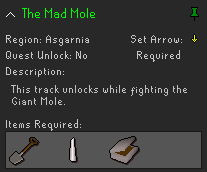
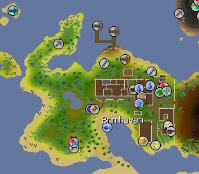
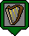
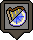

# Runelite Music Cape Helper Plugin

  
This plugin tracks the players completed music tracks and helps players to unlock incomplete music tracks. Please note, this plugin is work in progress and may contain bugs.

# Table of Contents
1. [Features](#features)
2. [Using the Plugin](#using-the-plugin)
3. [Configuration](#configuration)
4. [Feedback](#feedback)
5. [Credits](#credits)

## Features
- A customisable list of music tracks with the ability to filter out completed tracks.
- Details to provide help in unlocking music tracks including:
  - Unlock location.
  - Items required.
  - Whether it is required for the music cape unlock.
- An option to mark the location of the music track unlock area on the map interface.

## Using the Plugin
Upon starting up the plugin, a panel will be created which is used for most interactions with this plugin.

Panel Image

 

Panel Controls

#### Search Bar
The search bar is used to filter out tracks by name. 

#### Filters
The filters allow the player to customize what tracks appear using grouping.  

#### Display
The display toggle switches between showing all tracks currently unpinned/pinned.  

#### UI Controls
This group of control allow the player to interact with all music tracks shown. From left to right:
1. Pin all shown.
2. Unpin all shown.
3. Remove arrow tracker.
4. Rescind details
5. Expand details.
 

#### Track Selection
This list shows all music tracks that match the selected filters.
 

Track Selection Controls

The track selection shows further details about a specific music track.
 

Further details include:
- Region unlocked in.
- Whether it is an optional track (not required to unlock the music cape).
- The unlock description.
- If it is unlocked during a quest.
- Items required (if applicable).
   

By clicking on the pin icon ( AND ), this will add or remove the location to the players map.

 

Clicking on the set arrow button , an arrow ill guide the player whenever they get close to the music track unlock area.

Map Icons

(Green = Complete, Red = Incomplete, Grey = Config option).  
Map icons that can be unlocked outside a quest are represented like this:

  

Map icons that are unlocked during a quest are represented like this:
   

## Configuration

Config Image

Panel Settings

<b>Completed/Incomplete/Default Text Colour:</b> 
This will change how the music tracks in the panel are differentiated using the selected text colour.

<b>Hide panel once complete:</b> 
- Never: Will not disable the panel even if all tracks are completed.
- Required Only: Will disable the panel once all required music tracks for the music cape are completed.
- Optional and Required: Will disable the panel once all music tracks are complete.

Panel Row Settings

<b>Enable hint arrow feature:</b> 
When enabled, the player will be able to request an arrow to direct them towards the selected music tracks unlock location.

<b>Include description in row:</b> 
When enabled, all expanded music tracks will include the unlock description.

Map Settings

<b>Differentiate quest unlocks:</b> 
When enabled, music tracks marked on the map will change the display icon to show they are unlocked during a quest.

<b>Differentiate completed markers:</b> 
When enabled, complete pins will be represented a green border while incomplete will be represented with red.

<b>Unpin marker upon completion:</b> 
When enabled, once a music track has been completed, it will be unpinned from the map automatically.

<b>>Remove arrow upon completion:</b> 
When enabled, once a music track has been completed, any guidance arrow set will be removed automatically. 

## Feedback
If you have encountered any bugs please create an issue [here](https://github.com/Teekiz/music-cape-helper/issues/new). Feedback and feature requests are also welcome!

## Credits
- [Old School Runescape Wiki](https://oldschool.runescape.wiki/) - [Source](https://oldschool.runescape.wiki/w/File:Music.png) of the image used for the plugin's icon and a useful source of [information](https://oldschool.runescape.wiki/w/Music) aiding the development of the plugin.
